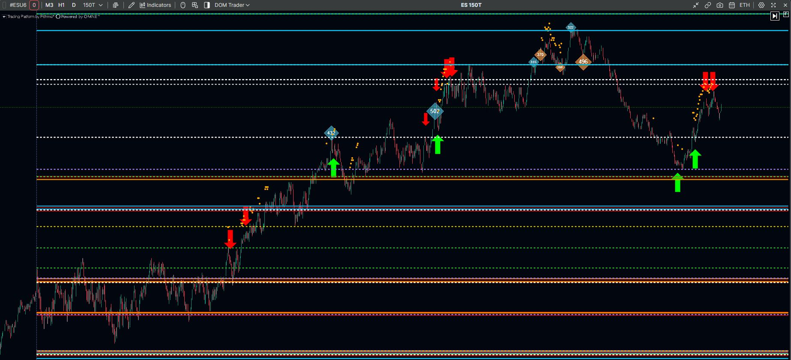
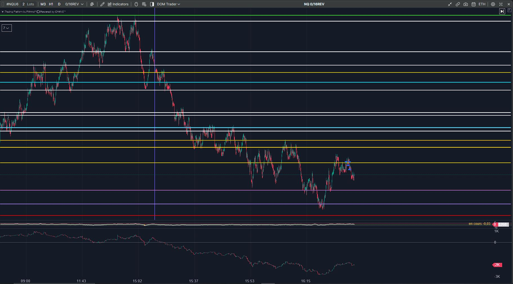

<!-- ========================================================================
     Gexbot Levels Pro — institutional distribution README
     Private GitHub repository — RELEASES + DOCUMENTATION ONLY (no source).
     ===================================================================== -->

# Gexbot Levels Pro

**Options-derived intervention levels for index futures — an ATAS X (`net10.0`) indicator.**

Gexbot Levels Pro renders, directly on the price chart, the gamma-driven
structural levels published by [GEXBOT](https://gexbot.com) — Major Positive /
Negative gamma, Zero-Gamma, per-strike GEX (by volume and by open interest) and
state-based Major Call / Major Put — and projects each of them onto the exact
price scale of the traded future. Designed for NQ and ES, the conversion engine
generalizes to any underlying/future pair for which a basis can be established.

> **Distribution note.** This repository ships **compiled, obfuscated releases and
> technical documentation only**. No source code is included.

---

## Screenshots

<!-- ============================================================
     HOW TO ADD SCREENSHOTS:
     1. Save the two PNGs into the  assets/  folder next to this file.
     2. Keep the file names below (or rename here to match yours).
     3. Commit + push (or drag the PNGs into assets/ on github.com).
     Recommended: 1200-1600 px wide, PNG, cropped to the chart.
     ============================================================ -->

**1) Example of EOD Level on ES (Asia / London Session)**

**2) Example of Live Level on NQ (Cash session — RTH)**

---

## 1. What it does

- **Level ingestion.** Pulls GEXBOT `classic` and `state` payloads (0DTE / 1DTE /
  aggregated 90-day expiries) for one or more configured tickers.
- **Scale projection.** Maps each underlying level onto the chart's future using a
  selectable conversion method (see §4). Native pairs (e.g. `NQ_NDX`, `ES_SPX`)
  require no conversion; index→future pairs use the official GEXBOT affine basis;
  single names use an iso-percentage ratio.
- **Confluence detection.** Optionally clusters levels that stack within a
  user-defined tick tolerance into highlighted zones, with configurable rules
  (minimum level count, distinct-source requirement).
- **Two operating modes.** *Frozen EOD* (one snapshot at load + one per new
  session, epoch-guarded and tagged) and *Live* (periodic refresh — fast `state`
  loop, slower `classic` loop).
- **Chart-native rendering.** Lines, labels and zones drawn in the price panel,
  with a keyboard shortcut to toggle the whole display.

---

## 2. Data provenance & accuracy

The indicator is a faithful **client-side renderer** of GEXBOT data — it computes
no proprietary greeks of its own. Two provenance facts are enforced in code:

- `state` levels are **volume-based** (open interest and zero-gamma exist only in
  `classic`); the two are never silently mixed.
- The conversion **basis decays intraday** (order of a few index points per day);
  a *Maximum basis age* guard prevents stale conversions from being displayed, and
  frozen levels are tagged when shown outside their session.

A dedicated **contract-roll guard** and explicit *forced-target ≠ chart instrument*
banners prevent the most common class of "silently wrong level" errors.

---

## 3. Requirements & installation

| Item | Requirement |
|------|-------------|
| Platform | **ATAS X** (Avalonia build, `%APPDATA%\ATAS X\Indicators`) |
| Runtime | `net10.0` |
| Data | A valid **GEXBOT API key** |

1. Download `Gexbot_Levels_Pro_Hermes.dll` from the latest **Release**.
2. Copy it into `%APPDATA%\ATAS X\Indicators`.
3. Restart ATAS X; add **Gexbot Levels Pro** to a chart.
4. Enter your GEXBOT API key and configure the ticker list (§4).

---

## 4. Key parameters

### Data source
| Parameter | Description |
|-----------|-------------|
| **GEXBOT API key** | Your GEXBOT credential. Required. |
| **Base URL** | GEXBOT API endpoint (default provided). |
| **Mode (frozen EOD / Live)** | Snapshot-at-load vs. periodic refresh. |
| **LIVE refresh rate (seconds)** | Cadence of the fast `state` loop in Live mode. |
| **Conversion basis refresh rate (seconds)** | Cadence at which the future/underlying basis is re-fetched. |
| **0DTE / 1DTE / Aggregated 90-day expiry** | Which GEXBOT expiries to source (`gex_zero` / `gex_one` / `gex_full`). |

### Conversion (underlying → future scale)
| Parameter | Description |
|-----------|-------------|
| **Target future (Auto = detected)** | ES / NQ / auto-detect from the chart instrument. |
| **Conversion** | Method per ticker: official GEXBOT affine, iso-% ratio, manual ratio, or native. |
| **Manual ratio** | Fixed multiplier for the manual method. |
| **Fall back to iso-% if auto conversion refused** | Graceful degradation when the official basis is unavailable (tagged on-screen). |
| **Maximum basis age (minutes)** | Rejects conversions older than this threshold. |
| **Contract roll guard** | Prevents a rolled contract from producing off-scale levels. |

### Levels to display
| Parameter | Description |
|-----------|-------------|
| **Major Positive / Negative** | Major gamma walls. |
| **Zero Gamma** | Gamma-flip level (with optional computed VOL/OI approximation). |
| **Major Call / Major Put (state)** | Volume-based state majors. |
| **Number of GEX levels (N)** | Top-N strikes to plot, by **volume** and/or **open interest**. |
| **Create confluence zones** | Cluster nearby levels into zones. |
| **Tolerance / zone height (ticks)**, **Minimum number of levels**, **Require different sources** | Confluence clustering rules. |

### Appearance & interaction
| Parameter | Description |
|-----------|-------------|
| **Per-level colors, line thickness, dashed OI lines** | Line styling. |
| **Level name position / hide names / label size** | Label control. |
| **Zone color / opacity / text / detail** | Confluence-zone styling. |
| **Status & regime panels, font sizes** | On-chart diagnostics. |
| **Display-toggle shortcut (+ modifier)** | Keyboard show/hide of the entire overlay. |
| **Ticker list** | Tree of underlyings, each with its own conversion and display selection. |

*Exact defaults and ranges are surfaced directly in the ATAS settings panel.*

---

## 5. License & support

### License — Proprietary, evaluation use

Copyright © 2026. **All rights reserved.**

Gexbot Levels Pro is proprietary software provided to the evaluating partner
**for internal evaluation purposes only**. No ownership or intellectual-property
right is transferred. Except as expressly authorized in writing by the author,
you may **not**:

- redistribute, sublicense, sell, lease, or otherwise transfer the software or
  the release binaries to any third party;
- decompile, disassemble, reverse-engineer, or otherwise attempt to derive the
  source code or internal logic of the software;
- remove or alter any copyright, attribution, or license notice.

The software is provided on an **"as is"** basis, without warranty of any kind,
under the terms of the Disclaimer in §6. Continued or production use beyond the
evaluation is subject to a separate commercial agreement.

### Support

<!-- TBD — support channel to be defined once the package is finalized. -->

*Support terms will be provided separately.*

---

## 6. Disclaimer

> **For informational and analytical purposes only. Not investment advice.**
>
> Trading futures, options and other leveraged instruments carries a substantial
> risk of loss and is not suitable for every investor. The levels, zones and
> signals produced by Gexbot Levels Pro are derived from third-party (GEXBOT)
> data and quantitative transformations that may contain errors, latency, or gaps,
> and are provided **"as is" without warranty of any kind**, express or implied,
> including but not limited to merchantability, fitness for a particular purpose,
> and non-infringement. Past performance is not indicative of future results.
> Nothing in this software constitutes a solicitation, recommendation, or offer to
> buy or sell any financial instrument. You are solely responsible for your own
> trading decisions and for any losses incurred. The author accepts no liability
> for any direct, indirect, incidental, or consequential damages arising from the
> use of this software or reliance on its output. By using this indicator you
> acknowledge and accept these terms.

---

*Gexbot Levels Pro is an independent tool and is not affiliated with, endorsed by,
or sponsored by GEXBOT, ATAS, or any exchange.*
